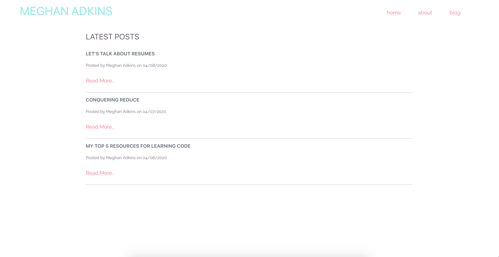

# Personal Blog

A markdown powered blog to help self-taught developers. While there are a lot of how-to posts available to self-taught developers, I noticed a lack of content regarding developers’ actual journeys.  I built this application to create an outline of my own journey, create relatable and honest content, and update the blog to continue sharing and helping others learn.

## Tech/Framework Used

**Built with**
- [React](https://reactjs.org/)
- [Styled Components](https://styled-components.com/)
- [Gatsby](https://www.gatsbyjs.org/)